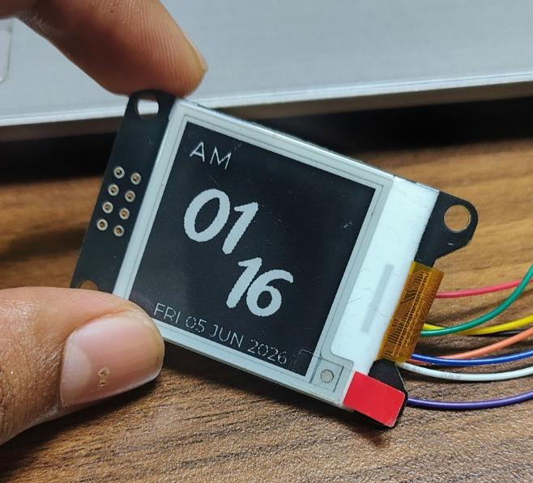
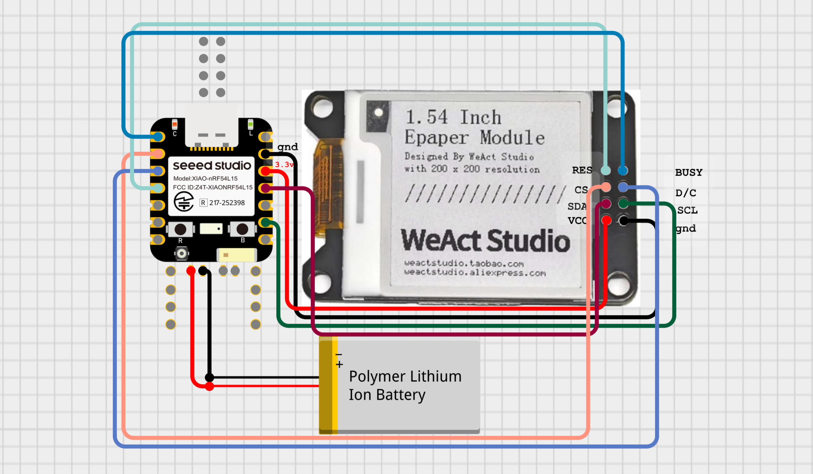

# NSL Watch - Zephyr & LVGL ePaper Watchface

Welcome to the **NSL Watch** project! This is a firmware example for creating a stylish flip-clock style watch face using Zephyr RTOS and LVGL on an ePaper display.




<!-- *(Replace `docs/images/watch_preview.png` with a path to your actual project image)* -->

## Project Overview

This project demonstrates how to build a watch user interface using LVGL (Light and Versatile Graphics Library) integrated with the Zephyr Real-Time Operating System. It is designed to run on the Seeed Studio XIAO nRF54L15 board and uses an ePaper display for ultra-low power consumption.

### Features
*   **Time Display:** Shows Hour, Minute, and AM/PM indicators.
*   **Date Display:** Shows Day of the week, Day, Month, and Year.
*   **Fonts:** Uses compressed Montserrat fonts (16px and 48px) to save space.
*   **Monochrome UI:** Optimized for ePaper (SSD16XX) 1-bit color depth.

## Hardware Requirements

*   **Development Board:** [Seeed Studio XIAO nRF54L15](https://wiki.seeedstudio.com/xiao_nrf54l15_sense_getting_started/)
*   **Display:** ePaper display compatible with the `SSD16XX` driver (SPI interface).

### Pin Connections

| E-Paper Pin | XIAO nRF54L15 Pin | nRF54L15 GPIO    |
| ----------- | ----------------- | ---------------- |
| VCC         | 3V3               | 3.3V             |
| GND         | GND               | GND              |
| SCL         | D8                | P2.01 (SPI_SCK)  |
| SDA (DIN)   | D10               | P2.02 (SPI_MOSI) |
| CS          | D1                | P1.05            |
| D/C         | D2                | P1.06            |
| RES         | D3                | P1.07            |
| BUSY        | D0                | P1.04            |
| MISO        | Not Connected     | —                |

## Software Stack & Versions

*   **Framework:** [Zephyr RTOS](https://zephyrproject.org/) `v4.2.1`
*   **GUI Library:** [LVGL](https://lvgl.io/) `v9.3.0`
*   **Build System:** [PlatformIO](https://platformio.org/) 

## How to Build and Upload

This project uses PlatformIO for dependency management and building. 

### Prerequisites
1. Install [PlatformIO Core](https://docs.platformio.org/page/core.html) or the PlatformIO IDE extension for VSCode.

### Commands

Open your terminal in the `NSL_Watch` project directory and run the following commands:

```shell
# Build the project for the seeed-xiao-nrf54l15 environment
pio run -e seeed-xiao-nrf54l15

# Upload the firmware to your connected board
pio run -e seeed-xiao-nrf54l15 --target upload

# Clean build files
pio run --target clean
```

<!-- ## Adding Images to README

To add your own images to this README:
1. Create a folder named `images` in your project root (or inside a `docs` folder).
2. Place your `.png`, `.jpg`, or `.gif` image inside that folder.
3. Update the Markdown image link at the top of this file to point to your new image:
   `` -->

## File Structure

*   `src/main.c`: The main application logic and LVGL UI creation.
*   `zephyr/prj.conf`: Zephyr and LVGL configuration options (e.g., enabling SPI, Display, adjusting memory pools).
*   `zephyr/boards/seeed_xiao_nrf54l15.overlay`: Hardware specific device tree overlay for the display.
*   `platformio.ini`: PlatformIO build environment configuration.

## Future Development

*   Make a 3D model for the watch case
*   Add BLE with a mobile app
*   Add step count tracking
*   Add a vibration motor for notifications/alarms
*   Test and optimize power consumption for better battery life
*   Add more watch faces
*   Add a small e-book reader feature
*   Add a menu navigation system
*   Add small games
*   Add voice control

## 🤝 Contributing

Pull requests are welcome! For major changes, please open an issue first to discuss what you’d like to change.